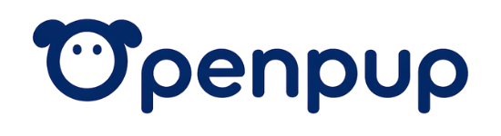
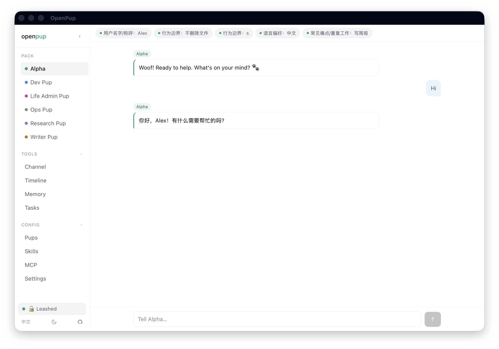
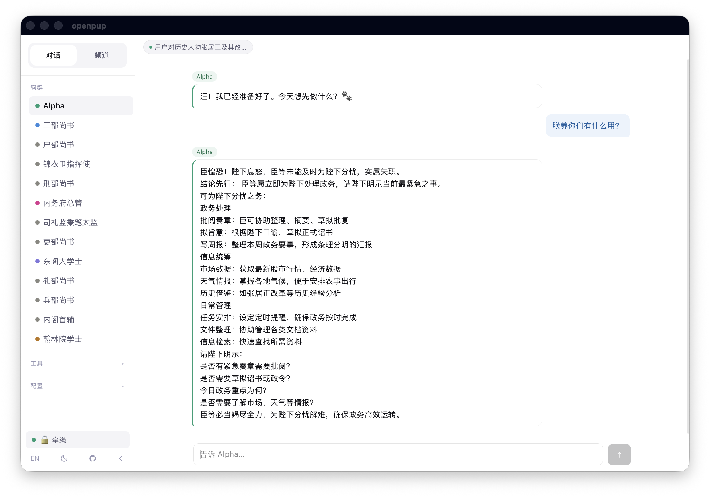
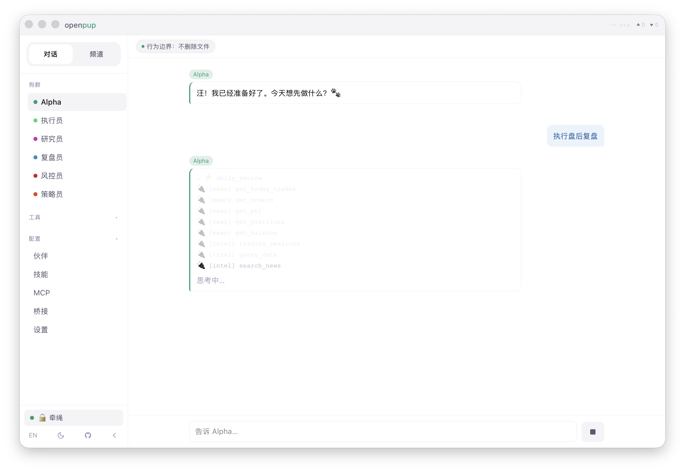
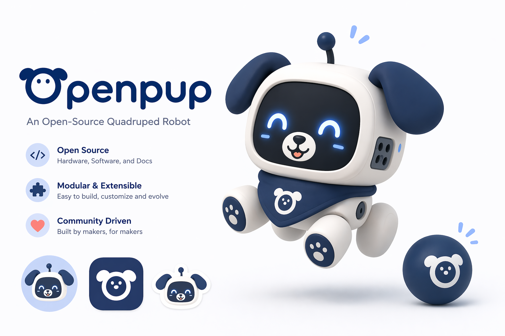
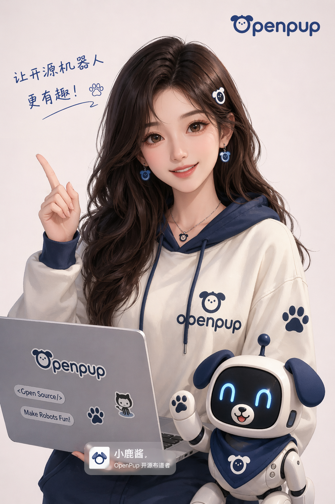

<div align="center">

<h1>
  
</h1>

**一只记得你是谁的小狗狗 · The local Pup that remembers who you are**

> Not another ChatGPT wrapper.
> Its memory files are yours to edit. Its skills run on your machine.
> The longer you use it, the better it knows you.

[](LICENSE-MIT)
[](LICENSE)
[](https://www.rust-lang.org)
[](https://tauri.app)

---

**[English →](README.en.md)** · **[中文 →](README.zh.md)** · **[Architecture →](docs/architecture.md)**



<p><strong>Ming Dynasty</strong></p>

<p><a href="./openpup-backup-Ming.zip">openpup-backup-Ming.zip</a></p>

<p><strong>AI Trading</strong></p>

<p><a href="./openpup-backup-Trading.zip">openpup-backup-Trading.zip</a></p>

</div>

---

## Quick Start

```bash
git clone https://github.com/openpup/openpup
cd openpup
npm install
npm run tauri dev          # desktop app (dev mode)
# or
cargo build --release -p openpup   # CLI only
```

Configure `~/.openpup/config.toml` (auto-created on first launch) with your API key and preferred model.

## What's Inside

A team of specialized pups handles your requests — **Alpha** orchestrates, **Dev / Writer / Ops / Research / Life Admin** execute. Messages route automatically based on intent; use `@dev` or `@writer` to address a pup directly.

All data lives in `~/.openpup/` — plain files, SQLite, no cloud.

## Docs

| Document | Contents |
|----------|----------|
| [README.en.md](README.en.md) | Full English guide — install, config, CLI, skills, MCP |
| [README.zh.md](README.zh.md) | 完整中文说明 |
| [docs/roadmap2.0.md](docs/roadmap2.0.md) | Configurable Organization OS |
| [docs/roadmap2.1.md](docs/roadmap2.1.md) | Agent collaboration spaces |
| [docs/architecture.md](docs/architecture.md) | Technical design — agent routing, memory system, IPC, data flow |

## Mascot & Merch

OpenPup is also growing a small visual world around the product, from mascot explorations to community merchandise.

<div align="center">
<table>
  <tr>
    <td width="70%" align="center" valign="top">
      
    </td>
    <td width="30%" align="center" valign="top">
      
    </td>
  </tr>
</table>
</div>

## License

[MIT](LICENSE-MIT) OR [Apache 2.0](LICENSE) — © 2026 OpenPup Contributors
