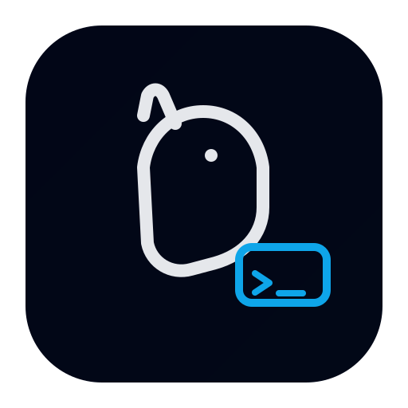

<div align="center">



# OpenPup

**一只记得你是谁的本地 AI 助手**

[](LICENSE-MIT)
[](LICENSE-APACHE)
[](https://www.rust-lang.org)
[](https://tauri.app)

[← 返回](README.md) · [English](README.en.md)

</div>

---

## 这是什么？

不是又一个 ChatGPT 套壳。

大多数 AI 工具在问：*「你想要一个什么样的 AI？」*
OpenPup 在问：**「你是一个什么样的人？」**

你的 `OWNER.md` 是核心——这是你写给自己的画像，每只小狗在每条消息里都会读它。对话、偏好和习惯会不断沉淀为**本地记忆**，是任何云端服务都无法复制或带走的。

### 为什么选 OpenPup？

- **以主人为中心，而不是以 prompt 为中心** — 你的身份（`OWNER.md`）贯穿每次交互。用得越久，它越懂你。
- **真正的多智能体协作** — 不只是路由到某个 agent。小狗之间可以在任务执行中互相委托（`pup_to_pup`），共享记忆，通过 DAG 编排的 Pack Channel 并行执行并支持 review 流程。
- **100% 本地，100% 属于你** — 所有数据在 `~/.openpup/`，没有云端锁定。整个 workspace 可导出为 zip，随时迁移。
- **自带模型** — OpenAI、Ollama、任何 OpenAI 兼容 API，改一行配置即可切换。
- **桌面 + CLI + 手机 + Bridge** — Tauri 桌面应用、无界面 CLI、Android/iOS、Telegram/微信/QQ/Discord，共享同一个大脑。
- **可扩展** — TOML 技能链、MCP 工具服务器、原生 Rust 插件，无需 fork 即可扩展系统。

### 团队

一组专业「小狗」负责处理你的请求：

| 小狗 | 职责 |
|------|------|
| Alpha | 总协调——了解你，调度其他小狗 |
| Dev | 软件工程、代码审查、调试 |
| Writer | 文章、邮件、报告、任何书面内容 |
| Ops | DevOps、服务器、部署、基础设施 |
| Research | 信息收集、摘要、分析 |
| Life Admin | 日程、规划、个人事务 |

小狗之间可以**互相委托任务** — Writer 可以让 Dev 查一下 API 签名，Dev 可以让 Research 查阅文档 — 全部在一个对话轮次内完成。

所有数据保存在 `~/.openpup/`——纯文本文件，随时可读、可编辑、可备份。

---

## 与OpenClaw等对比

三个主流开源 Agent 框架，各有侧重：

### 核心对比

| | **OpenPup** | **OpenClaw** | **OpenFang** |
|---|:---:|:---:|:---:|
| **定位** | 个人桌面助手 | 多渠道网关 | Agent 操作系统 |
| **核心创新** | OWNER.md（主人中心） | 多Agent路由 + 27+ 渠道 | 7个自治Hands（预构建） |
| 技术栈 | Rust + Tauri | Node.js + WebSocket | Rust（14 crates） |
| 内存占用 | ~40 MB | ~394 MB | ~40 MB |
| 启动时间 | 毫秒级 | ~6 秒 | <200 ms |
| 专家团队 | ✅ 5 只 + 协调 | 路由到单一 Agent | 运行Hands（非Agent） |
| 界面 | 桌面应用 + CLI | Web UI + 消息渠道 | 仪表板 + CLI |
| 渠道支持 | 内部集成 | 27+ 平台（WhatsApp/Telegram等） | 40+ 平台网关 |
| 使用场景 | 日常助手 | 重度多渠道用户 | 自主业务流程 |
| License | MIT / Apache 2.0 | MIT（基金会维护） | MIT |

### 简明对比

**OpenPup**
核心：把你的身份（`OWNER.md`）写进系统，小狗们深度了解你。专业分工（Dev/Writer/Research/Ops/LifeAdmin），本地桌面应用。适合想要一个逐渐更懂自己的日常伴侣的人。

**OpenClaw**
核心：多渠道网关 + 多Agent路由。单一AI助手，但能同时在 WhatsApp、Telegram、Slack、Discord 等 27+ 平台活动。适合需要跨渠道统一存在感的重度用户。

**OpenFang**
核心：7个预构建的自治能力包（"Hands"）——Lead 生成、视频剪辑、信息收集等。自主执行，无需对话干预。适合需要自动化业务流程（销售、研究、运维）的团队。

---

## 功能特性

- **流式聊天** + 智能多智能体路由
- **长期记忆** — 每 5 条消息自动提取事实、偏好与规则；Weibull 衰减加权检索，近期记忆优先但不遗忘；语义去重防止噪音累积。长期记忆全局共享，对话记忆 per-pup 独立
- **规则系统** — `RULES.md` 中的规则强制注入每次对话，确保小狗始终遵守你的边界和偏好
- **知识库** — 导入文档（PDF/TXT/MD）自动分块索引，对话时语义检索相关片段注入上下文，让小狗基于你的私有知识回答
- **Token 预算管理** — 实时追踪每个 Pup 的 context token 用量；超过 85% 自动裁剪历史；工具返回结果按 context 比例动态截断；MCP 工具超过 30 个时自动延迟加载 schema，节省 token
- **多层上下文压缩** — 三级压力（micro/full/persist）：轻度压力时摘要压缩旧轮次，重度时提取关键记忆持久化并重置上下文，长对话不丢关键信息
- **技能系统** — 可安装的 TOML 格式提示链（兼容 [ClaWHub](https://clawhub.ai)）
- **MCP 支持** — 通过 Model Context Protocol（rmcp，流式 HTTP）接入外部工具
- **Pack Channel** — DAG 编排的多 Pup 协作，支持并行执行、依赖注入和用户 review 流程
- **Pup 互相委托** — 小狗在任务执行中调用其他小狗获取跨领域能力
- **Bridge 平台** — Telegram、微信、QQ Bot、Discord
- **牵绳 / 自由运行模式** — 每次操作均确认，或让小狗自主执行
- **权限系统** — 三级风险（高/中/低），支持对常用操作的持久信任
- **任务追踪** — 创建并跟踪任务生命周期（待处理→进行中→完成/失败）
- **CLI + Daemon** — 无界面运行时，daemon 常驻维持 bridge、scheduler 与 Pack Channel
- **移动端** — Android / iOS 通过 Tauri Mobile 支持，共享同一个 core
- **Workspace 备份** — 将 `~/.openpup/` 导出/导入为 zip
- **插件 API** — 将自定义小狗编译为原生动态库（`.dylib`/`.so`/`.dll`）
- **主题** — GitHub 风格深色与浅色

---

## 安装

### 下载发布版（推荐）

从 [Releases 页面](../../releases) 下载：

| 平台 | 桌面应用 | CLI 二进制 |
|------|----------|------------|
| macOS（Apple Silicon） | `openpup-*.dmg` | `openpup-cli-*-darwin-aarch64.tar.gz` |
| macOS（Intel） | `openpup-*.dmg` | `openpup-cli-*-darwin-x86_64.tar.gz` |
| Linux x86_64 | `openpup-*.AppImage` | `openpup-cli-*-linux-x86_64.tar.gz` |
| Windows | `openpup-*-setup.exe` | `openpup-cli-*-windows-x86_64.tar.gz` |

### 从源码构建

**前置条件：** Node.js 18+、Rust stable、[Tauri 系统依赖](https://tauri.app/start/prerequisites/)

```bash
git clone https://github.com/openpup/openpup
cd openpup

# 桌面应用
npm install
npm run tauri build

# 仅构建 CLI（更快，无需 Node.js）
cargo build --release -p openpup
```

---

## 配置

首次启动时，openpup 会创建 `~/.openpup/config.toml`：

```toml
[llm]
provider   = "openai"          # "openai"（OpenAI 兼容 API）或 "ollama"（本地）
model      = "gpt-4o"
mini_model = "gpt-4o-mini"     # 用于分类任务的轻量模型
api_key    = "sk-..."          # 或设置环境变量 OPENPUP_API_KEY
api_base   = ""                # 留空使用默认值
                               # 例：https://api.siliconflow.cn/v1

[app]
execution_mode = "leashed"     # "leashed"（操作前确认）或 "freerun"（自主执行）
theme          = "dark"        # "dark" 或 "light"
language       = "zh"          # "zh" 或 "en"

[pups]
enabled = ["alpha", "dev", "writer", "ops", "research", "life_admin"]
```

完整参考模板：[`workspace/config.toml`](workspace/config.toml)

**环境变量覆盖**（优先级高于配置文件）：

| 变量 | 用途 |
|------|------|
| `OPENPUP_API_KEY` | API 密钥 |
| `OPENAI_API_KEY` | 备用 API 密钥 |
| `OPENAI_BASE_URL` | Base URL 覆盖 |
| `OPENPUP_LLM_PROVIDER` | `openai` 或 `ollama` |

---

## CLI 用法

CLI 现在是 **headless OpenPup**：与桌面端共享同一份 `~/.openpup/` 工作区，读取同一套 `config.toml`、`database.db`、`mcp_servers.json` 与 `skills_state/`。在 v2 中，CLI 默认优先连接本地 `openpupd` daemon，把会话、bridge、Pack Channel 与 scheduler 交给常驻进程维持；只有显式传 `--local` 或 daemon 不可用时，才退回到当前进程内运行。

```bash
# 对话
openpup chat                          # 与 Alpha Pup 对话
openpup chat --pup dev                # 直接路由到 Dev Pup
openpup ask "帮我总结今天的待办"       # 单次提问，适合脚本或快速调用
openpup ask "检查这个报错" --pup dev  # 单次提问并强制路由到指定 Pup
openpup --local status                # 显式绕过 daemon，走本地 fallback

# 记忆管理
openpup memory list                   # 浏览长期记忆
openpup memory search "python 偏好"   # 按内容搜索
openpup memory count                  # 总记忆数量

# 技能
openpup skill list                    # 已安装的技能
openpup skill run weekly_summary      # 运行技能
openpup skill run my_skill --input "上下文文本"

# 状态概览
openpup status

# Daemon
openpup daemon start                  # 启动本地 openpupd
openpup daemon status                 # 查看 PID / socket / 健康状态
openpup daemon logs                   # 查看 daemon 日志
openpup daemon stop                   # 停止 daemon

# Bridge
openpup bridge status                 # 查看 bridge 连接状态
openpup bridge config                 # 查看当前 bridge 配置
openpup bridge reload                 # 按最新配置重载 bridge
openpup bridge weixin qr-start        # 发起微信二维码登录
openpup bridge weixin qr-wait <key>   # 轮询登录结果
openpup bridge weixin accounts        # 查看已保存微信账号

# Pack Channel
openpup channel list --limit 20       # 查看最近频道
openpup channel show <channel_id>     # 查看频道详情 / plan / 消息
openpup channel watch <channel_id>    # 轮询观察频道进度
openpup channel continue <id> "继续"  # 继续执行
openpup channel request-changes <id> "请补充来源"
openpup channel comment <id> "我建议改成表格"
```

补充说明：

- `openpup chat` 和 `openpup ask` 都会走 Alpha/多 Pup 路由，并共享桌面端已有对话上下文与长期记忆。
- `openpup skill run` 走真实技能执行器，会读取与桌面端一致的技能注册信息和 MCP 配置。
- `openpup daemon start` 后，Weixin / Telegram bridge、Pack Channel 控制面与 scheduler 会在后台持续运行，不依赖桌面端窗口存活。
- `openpup bridge ...` 与 `openpup channel ...` 走 daemon 控制面；桌面端与无界面模式复用同一套 bridge 配置与频道数据。
- 在 `leashed` 模式下，CLI 会在终端内提示权限确认；配置来源与桌面端保持一致。

---

## 技能系统

技能是 TOML 格式的提示链定义，兼容 [ClaWHub](https://clawhub.ai) 技能格式：

```toml
name        = "daily_summary"
description = "从记忆生成每日总结"
version     = "1.0.0"

[[steps]]
type   = "search_memories"
query  = "今天的活动和任务"
limit  = 20

[[steps]]
type   = "generate_with_llm"
prompt = "基于以下记忆，写一份简洁的每日总结：\n{{memories}}"
```

通过 App 中的 **Skills → 从 Git 安装** 可安装任意 Git 仓库中的技能。[ClaWHub 技能库](https://clawhub.ai/PhenixStar/skill-hub) 会在首次运行时自动安装。

---

## MCP 集成

openpup 使用 [rmcp](https://github.com/modelcontextprotocol/rust-sdk)（官方 MCP Rust SDK）的流式 HTTP 传输。在 **Settings → MCP** 中添加服务器，或直接编辑 `~/.openpup/mcp_servers.json`。

---

## 插件开发

将自定义小狗编译为原生动态库：

```rust
#[no_mangle]
pub extern "C" fn create_pup() -> *mut dyn SpecialistPup {
    Box::into_raw(Box::new(MyPup::new()))
}
```

编译为 `cdylib`，放入 `~/.openpup/plugins/`。详见 [`plugins/example_pup/README.md`](plugins/example_pup/README.md)。

---

## Workspace 目录结构

```
~/.openpup/
├── config.toml          ← 全部配置
├── database.db          ← SQLite：对话、记忆、任务、技能运行记录
├── OWNER.md             ← 你的画像——姓名、偏好、背景
├── PUPS.md              ← 小狗定义
├── RULES.md             ← 小狗遵循的规则（可自进化）
├── memories/            ← 每日日志（YYYY-MM-DD.md）
├── skills_state/        ← 已安装技能清单及注册源状态
├── mcp_servers.json     ← MCP 服务器列表
└── plugins/             ← 原生小狗插件（.dylib / .so / .dll）
```

---

## 许可证

[MIT](LICENSE-MIT) OR [Apache 2.0](LICENSE-APACHE) — © 2026 OpenPup Contributors
