# OpenPup — Technical Architecture

> Reference for developers and contributors. Covers system design, data flow, key modules, and extension points.

---

## Overview

OpenPup is a local-first, single-owner, multi-agent desktop AI assistant built with:

| Layer | Technology |
|-------|-----------|
| Desktop shell | Tauri 2.0 (Rust backend + WebView frontend) |
| Frontend | React 19 + TypeScript + Tailwind CSS |
| Backend runtime | Rust / Tokio (async) |
| IPC | Tauri `invoke()` (commands) + `emit()`/`listen()` (events) |
| Storage | SQLite via `rusqlite`; vector search via `sqlite-vec` |
| LLM | OpenAI-compatible REST API (also supports Ollama) |
| MCP | `rmcp` (official MCP Rust SDK) — streamable HTTP transport |

---

## Repository Layout

```
openpup/
├── src/                    # React frontend
│   ├── App.tsx             # Root component — routing, state, event listeners
│   └── components/         # UI panels (Chat, Memory, Tasks, Skills, Settings…)
├── src-tauri/src/          # Rust backend
│   ├── main.rs             # Tauri app setup; registers all commands
│   ├── commands.rs         # Tauri command handlers (IPC bridge)
│   ├── config.rs           # Config loading (TOML + env var overrides)
│   ├── agents/             # AlphaPup orchestrator + 5 specialist pups
│   ├── memory/             # Memory system (file layer + SQLite/vector layer)
│   ├── skills/             # Skills registry, executor, scheduler, permissions
│   ├── tools/              # Primitive tool wrappers (shell, file, search…)
│   ├── mcp/                # MCP client/server orchestrator
│   ├── llm/                # LLM client (streaming, config, multi-provider)
│   ├── channel/            # Channel types (Pack Channel placeholder)
│   └── workspace/          # Workspace backup/restore
├── cli/                    # CLI binary (`openpup` REPL)
├── plugins/                # Example native pup plugin (cdylib)
├── skills/                 # Built-in skill manifests (TOML)
├── workspace/              # Default workspace template files
└── docs/                   # Design docs and diagrams
```

---

## Agent Architecture

### Routing Pipeline

Every user message follows this decision chain in `alpha.rs`:

```
User message
     │
     ▼
1. forced_pup?          ← frontend can pin a pup (e.g. Settings UI)
     │  no
     ▼
2. @mention prefix?     ← extract_at_mention() checks "@key " at start
     │  yes → route directly to that SpecialistPup (bypass Alpha classify)
     │  no
     ▼
3. classify_intent()    ← mini_model LLM call, returns one of:
     │                     "self" | "dev" | "writer" | "ops" |
     │                     "research" | "life_admin" |
     │                     "channel:pup1,pup2,..."
     │
     ├── single pup  → run_specialist_pup() → stream to chat
     └── channel:... → run_parallel_pack()  → stream individual results
                                            → aggregate via LLM
                                            → stream final summary
```

### AlphaPup (`agents/alpha.rs`)

Central orchestrator. Key responsibilities:

- Builds message context: `OWNER.md` summary (~200 tokens) + top-5 semantic memories (~300 tokens) + recent conversation history (~500 tokens)
- Runs `classify_intent` using `mini_model` to keep classification cheap
- Dispatches to specialist pups or handles in-context
- Manages per-pup conversation history (stored in `conversations` table with `pup` column)
- Auto-compresses context via `maybe_compress_context()` (triggered at configurable message count)

### Specialist Pups (`agents/`)

| File | Pup | Focus |
|------|-----|-------|
| `dev_pup.rs` | Dev | Code, debugging, engineering tasks |
| `writer_pup.rs` | Writer | Writing, editing, translation |
| `ops_pup.rs` | Ops | DevOps, infrastructure, shell tasks |
| `research_pup.rs` | Research | Information retrieval, summarization |
| `life_admin_pup.rs` | Life Admin | Scheduling, personal organization |
| `custom_pup.rs` | Custom | Dynamic pups defined in `PUPS.md` |
| `plugins.rs` | Plugin host | Loads native `.dylib`/`.so`/`.dll` pups |

All specialist pups implement the `SpecialistPup` trait (`specialist.rs`).

### Parallel Pack (`run_parallel_pack`)

When `classify_intent` returns `channel:pup1,pup2`:

1. Emits `stream_activity` routing event so the UI shows which pups are active
2. Spawns each pup concurrently via `tauri::async_runtime::spawn`
3. Collects results; aggregates via `aggregate_channel_results()` (LLM merge)
4. Streams the final aggregated summary back to chat

> **Pack Channel** (future): True async message-bus coordination where pups can `@mention` each other, with dependency-aware scheduling and artifact persistence. Currently a UI placeholder — see `PackChannel.tsx`.

---

## Memory System

### Two-layer design

```
File layer (human-readable, auditable)        ~/.openpup/
  OWNER.md       — owner profile (name, prefs, background)
  PUPS.md        — pup role definitions and constraints
  RULES.md       — evolving behavioral rules
  memories/      — daily diary logs (YYYY-MM-DD.md)

Database layer (SQLite at ~/.openpup/database.db)
  conversations       — full message history, scoped by pup
  long_term_memory    — extracted facts (semantic dedup)
  memory_vectors      — sqlite-vec embeddings (all-MiniLM-L6-v2)
  context_summaries   — compressed context snapshots per pup
  tasks               — task lifecycle records
  skill_runs          — skill execution log
```

### Memory extraction

AlphaPup calls `extract_memories()` only when both conditions are met:
- a minimum conversation spacing threshold has elapsed
- the latest user turn looks memory-worthy (preference, rule, stable fact, etc.)

When extraction fires:
- LLM identifies new facts about the owner
- Embedding generated locally (all-MiniLM-L6-v2 via `fastembed`)
- Semantic dedup: new fact is only inserted if cosine similarity to existing memories is below threshold
- Stored in `long_term_memory` + `memory_vectors`

### Context compression

When a pup's conversation history exceeds the configured window:
- `maybe_compress_context()` generates a rolling summary
- Stored in `context_summaries` with the pup key
- Injected as a "system context" prefix on the next request
- Original messages pruned to keep token budget under control

---

## LLM Client (`llm/client.rs`)

Supports two providers, both accessed via OpenAI-compatible REST:

| Provider | `api_base` |
|----------|-----------|
| OpenAI / compatible | `https://api.openai.com/v1` (default) |
| Ollama | `http://localhost:11434/v1` |
| Third-party (e.g. SiliconFlow) | Custom `api_base` in config |

Two model slots:
- `model` — main model for all generation tasks
- `mini_model` — cheaper/faster model for `classify_intent` and other classification calls

All generation uses **streaming** (`stream: true`), with SSE chunks forwarded to the frontend via `stream_token` Tauri events.

---

## Skills System (`skills/`)

Skills are TOML manifests defining multi-step prompt chains:

```toml
name        = "daily_summary"
version     = "1.0.0"
description = "Summarize today from your memories"

[[steps]]
type  = "search_memories"
query = "today's activities"
limit = 20

[[steps]]
type   = "generate_with_llm"
prompt = "Write a concise daily summary:\n{{memories}}"
```

Pipeline:
- `registry.rs` — discovers and indexes installed skill manifests
- `executor.rs` — runs each step in sequence (memory search, LLM generate, tool call, etc.)
- `scheduler.rs` — cron-like scheduled execution
- `permissions.rs` — risk-tier gating before tool-invoking steps

Skills are compatible with the [ClaWHub](https://clawhub.ai) format and installable from any Git repository.

---

## MCP Integration (`mcp/`)

Uses [`rmcp`](https://github.com/modelcontextprotocol/rust-sdk) — the official Rust MCP SDK.

- **Client** (`orchestrator.rs`): connects to external MCP servers (GitHub, Notion, Calendar, etc.) configured in `~/.openpup/mcp_servers.json`
- **Server** (`server.rs`): exposes local tools (file access, shell execution, browser) to MCP clients

Transport: streamable HTTP only (no stdio sidecar processes).

---

## IPC: Commands & Events

### Tauri commands (frontend → backend)

Key commands registered in `main.rs`:

| Command | Purpose |
|---------|---------|
| `send_message` | Primary chat — routes through AlphaPup pipeline |
| `get_memories`, `search_memories`, `delete_memory` | Memory CRUD |
| `get_tasks`, `create_task`, `update_task` | Task management |
| `get_pup_conversation`, `clear_pup_history` | Per-pup chat history |
| `compress_pup_context` | Trigger context compression manually |
| `install_skill_from_git`, `run_skill` | Skills |
| `get_config`, `save_config` | Settings |
| `backup_workspace`, `restore_workspace` | Workspace backup |
| `list_mcp_servers`, `add_mcp_server` | MCP config |

### Tauri events (backend → frontend)

| Event | Payload | When |
|-------|---------|------|
| `stream_token` | `{ token: string }` | Each LLM token |
| `stream_done` | `{ pup: string }` | Response complete |
| `stream_activity` | `{ label: string, type: string }` | Routing/status updates |
| `permission_request` | `{ tool, risk, description }` | Tool execution in leashed mode |

---

## Conversation & Context Scoping

Conversations are stored in a single `conversations` table with a `pup` column:

```sql
CREATE TABLE conversations (
    id        INTEGER PRIMARY KEY,
    pup       TEXT NOT NULL,   -- "alpha", "dev", "writer", …
    role      TEXT NOT NULL,   -- "user" | "assistant"
    content   TEXT NOT NULL,
    timestamp INTEGER NOT NULL
);
```

Context summaries are similarly scoped per pup:

```sql
CREATE TABLE context_summaries (
    pup      TEXT PRIMARY KEY,
    summary  TEXT NOT NULL,
    updated  INTEGER NOT NULL
);
```

This allows each pup to maintain an independent conversation thread while all messages flow through a single unified chat UI.

---

## Pack Channel Architecture (Planned)



The future Pack Channel will introduce a message-bus layer enabling pup-to-pup `@mention` communication:

1. **Tokio broadcast bus** — central channel router in `channel/manager.rs`
2. **@mention addressing** — a pup's output can target another pup (`@research please verify this`)
3. **Dependency-aware scheduling** — Alpha analyzes task graph, sequences or parallelizes accordingly
4. **Artifact persistence** — intermediate outputs written to `~/workspace/channels/{id}/`
5. **Spectator UI** — real-time replay of the full inter-pup conversation in the Pack Channel view

Current implementation (v0.1): parallel fan-out (`run_parallel_pack`) with LLM aggregation. True async coordination is the next milestone.

---

## Plugin API

Custom specialist pups can be compiled as native dynamic libraries:

```rust
// In your plugin crate (crate-type = ["cdylib"])
#[no_mangle]
pub extern "C" fn create_pup() -> *mut dyn SpecialistPup {
    Box::into_raw(Box::new(MyPup::new()))
}
```

Place the compiled library in `~/.openpup/plugins/`. OpenPup loads it at startup via `plugins.rs`.

See [`plugins/example_pup/`](../plugins/example_pup/) for a complete example.

---

## Configuration

`~/.openpup/config.toml`:

```toml
[llm]
provider   = "openai"
model      = "gpt-4o"
mini_model = "gpt-4o-mini"
api_key    = "sk-..."
api_base   = ""              # custom endpoint, e.g. SiliconFlow

[app]
execution_mode = "leashed"   # "leashed" | "freerun"
theme          = "dark"
language       = "zh"        # "zh" | "en"

[pups]
enabled = ["alpha", "dev", "writer", "ops", "research", "life_admin"]
```

Environment variables take precedence: `OPENPUP_API_KEY`, `OPENAI_API_KEY`, `OPENAI_BASE_URL`, `OPENPUP_LLM_PROVIDER`.

---

## Data Flow: A Single Message

```
1. User types in Chat → React calls invoke("send_message", { content, pup: null })
2. commands.rs::send_message() → acquires AppState lock → calls alpha.do_stream()
3. alpha.do_stream():
   a. Load OWNER.md summary + top-5 memories + recent history, and optionally inject lightweight KB retrieval for knowledge-seeking queries
   b. forced_pup? → skip to step d
   c. @mention in message? → set target pup
      else classify_intent(mini_model) → pick pup or "channel:…"
   d. If channel: → run_parallel_pack() → concurrent specialist calls → aggregate
      If single pup: → pup.stream_response() → SSE chunks forwarded
4. Each LLM token → emit("stream_token", { token }) → React appends to bubble
5. On finish → emit("stream_done", { pup }) → React marks bubble complete
6. Memory extraction runs in the background only after minimum spacing and a memory-worthy turn signal
```

---

## Contributing

1. Fork → feature branch → PR against `main`
2. Run `cargo test` before submitting
3. Frontend: `npm run dev` (hot reload via Vite + Tauri dev server)
4. Full build: `npm run tauri build`
5. Lint: `cargo clippy` + `npm run lint`

## License

Licensed under either of [MIT](../LICENSE-MIT) or [Apache 2.0](../LICENSE-APACHE) at your option.

Key invariants to preserve:
- All user data stays in `~/.openpup/` — no telemetry, no cloud writes
- Token budget: system context must stay under ~1100 tokens total
- `mini_model` is used for all classification/routing — never the main model
- Streaming must remain real-time — no buffering before display
